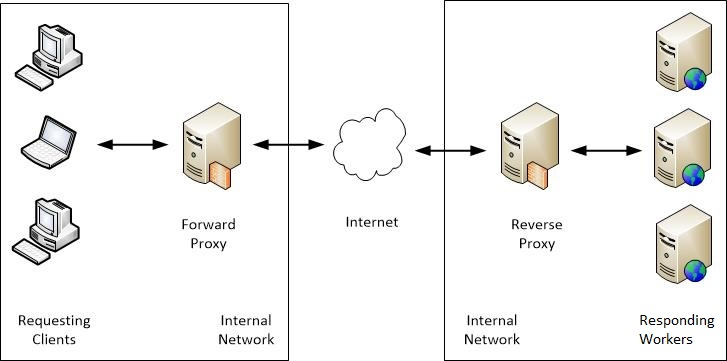
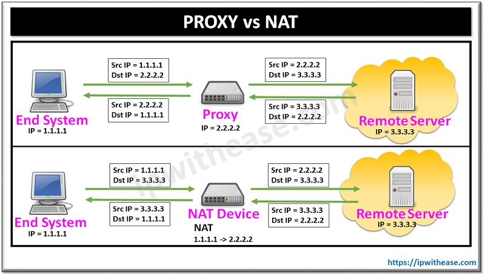

# Nginx Proxy_pass İncelemesi 

Merhaba arkadaşlar,

Bu makalede nginx üzerinden proxy kavramını inceleyeğiz ve bunu proxy-pass directive kullanarak örneklendireceğiz. Bunu yaparken amacımız ileride daha derine ineceğimiz Nginx için aynı zamanda bir altyapı oluşturmak. Devam etmeden önce bir iki kavramı karşılaştırmalı olarak anlamaya çalışalım. Makaledeki örnekler için ön şartımız biraz Docker bilmek. 

**Genel Kavramlar**

- **Forward-Proxy:** İstemcileri iç network'den dış network'e çıkartırken ara bir katman (proxy sunucusu - vekil sunucu) kullanmayı ifade eder. Amaç dışarıyı içeriden gizlemektir.
- **Reverse-Proxy:** İstemciden gelen talebi sunucuya iletirken ara bir katman (proxy sunucu - vekil sunucu) kullanmayı ifade eder. Amaç içeriyi dışarıdan gizlemektir.


[Resim Kaynak](https://techsightings.com/key-differences-between-the-forward-and-reverse-proxy/)

- **Proxy:** Tek başına sadece proxy dediğimizde aslında forward-proxy'yi ifade etmiş oluyoruz.
- **NAT vs Forward Proxy:** Sonucu aynıymış gibi görünmesine rağmen yani ikiside iç network'den dış network'e çıkışta bir ara katman (sunucu, NAT cihazı, router vb) kullanmayı ifade rağmen NAT network layer üzerinde çalışırken Forward Proxy applicaiton layer üzerinde çalışır. Ayrıca Proxy destination ip adreslerini gizlerken NAT gizlemez. Bu da zaten amaçlarındaki farklardan biridir.


[Resim Kaynak](files/https://ipwithease.com/proxy-vs-nat/)
- **Load Balancer:** İstemcilerden gelen trafiğin ara bir katman (load balancer) ile arkadaki sunucularadan birine yönlendirilmesidir. Amaç gelen yükü eşit olarak dağıtmaktır.

Tabiiiki buradaki ayrıştırmayı tek taraflı yapmış olduk. Bu araçları güvenlik, performans ve yüksek erişilebilirlik kavramları üzerinden incelediğimizde her birinin farklı özellikleri ortaya çıkacaktır. 

**Nginx Kavramları**

- **Proxy_pass vs Proxy_redirect:** Proxy-pass gelen isteği diğer bir sunucuya yönlendirmek ve oradan gelen isteği tekrar istemciye iletmek için kullanılır. Proxy-redirect ise isteği olduğu gibi 3xx kodu ile diğer bir suncunun sorumluluğuna yönelendirmek için kullanılır. Yönlendirme sonrasında proxy sunucusu aradan tamamen çekilir.
- **Upstream Kavramı:** Nginx için bir veya daha fazla sunucuyu tanımlamak için kullanılan bloktur. Örneğin Nginx ile bir yük dengeleiyi oluşturulmak istenildiğinde yönelendirme  yapılacak sunucular pustream bloğu için de tanımlanır. 


Kaynaklar:
- [Nginx resmi dökümanları - proxy-redirect](http://nginx.org/en/docs/http/ngx_http_proxy_module.html#proxy_redirect)
- [Nginx resmi dökümanları - proxy-pass](http://nginx.org/en/docs/http/ngx_http_proxy_module.html#proxy_pass)
- [Nginx resmi dökümanları - upstream ile güvenlik](https://docs.nginx.com/nginx/admin-guide/security-controls/securing-http-traffic-upstream/)


Şimdi Proxy-pass ile ufak bir proxy uygulaması yapalım ve beraber detayları inceleyelim.

## Proxy_pass Directive Kavramı

Gelen istekleri olduğu gibi arkadaki sunucuya iletmek için kullanılır. Konuyu anlmak için iki adet nginx konteyner çalıştıracağız. Birincisi proxy sunucumuz diğeri de web sunucumuz olacak.

```shell
docker run -d --name reverse-proxy -p 80:80 ubuntu/nginx
docker run -d --name web-server -p 8080:80 ubuntu/nginx
```

İkş container'ı da test ediyoruz.

```shell
curl http://localhost:80
curl http://localhost:8080
```
Web sunucumuzdaki açılış sayfasını değiştirrmek için web-server isili container'a giriş yapıyoruz.

```
docker exec -it web-server bash
```

default website'ın a.ılış sayfasını düzenliyoruz. İçiriğini istediğiniz gibi değiştrebilirsiniz.

```
vim index.nginx-debian.html
```

Tekrar test ettiğinizde açılış sayfasının değişmiş olması lazım.

```
curl http://localhost:8080
```

Amacımız host makinamızda http://localhost:80 adresini çağırdığımızda 8080 portuna yönlenerek web sayfasımızı açmasını sağlamak. Ancak reverse-proxy kendi netwokündeki makinaları bildiğinden aynı networkde olan başka bir ip adresinin (yani web server'ın) 80. portuna istekleri yönlendiriyor olacak. Tabiiki gerçek ortamı simüle ettiğimiz için aynı network diyoruz. Yoksa tabiiki istersek docker konteyner host makinasının network'üne de ulaşabilir.

Nginx kurulduğunda default sayfa için hazır bir konfigürasyona gelir bu dosyayı /etc/nginx/sites-available dizininde default dosyasında bulabiliriz. Bu dosyayı düzenlemeden kendi sayfamızı da eklememiz mümkün. Ancak bu durumda localhost yerine başka bir domain adı kullanmamız gerekiyor. Bunun için helloworld.com domainini kullanacağız. Host makinamızdaki (yani docker konteynerden çıkıyoruz) host dosyasını düzenliyoruz.

```
sudo vim /etc/hosts
# dosyaya alttaki satırlaı ekleyip çıkıyoruz
127.0.0.1 helloworld.com
```

Daha sonra tekrar reverse-proxy konteynere giriş yapıyoruz.

Aşağıdaki komutla nginx.conf dosyamızı inceleyecek olursak _Virtual Host Configs_ başlığını görebiliriz. Bu başlık bize http ayarlarının olduğu http blokları içinde sanal bir hosta ihtiyacın varsa alttaki dizinleri kullnabilirsin. Bu diznlerden biri _sites-enabled_ dieri ise _conf.d_. _sites-enabled_ dizini genellikle web siteleri için kullanıldığından biz proxy veya load balancer gibi daha çok yönlendşr eişleri için kulanılan _conf.d_ dizinini kullnacağız.

```

sudo cat /etc/nginx/nginx.conf

# dosya içeriği

...
        ##
        # Virtual Host Configs
        ##

        include /etc/nginx/conf.d/*.conf;
        include /etc/nginx/sites-enabled/*;

...

```

Halen container içindeyken conf dosyamızı aşağıdaki içerikler birlikte oluşturuyoruz.

```
vim /etc/nginx/conf.d/helloworld.conf

# içeriğine aşağıidaki satırları kopyalıyoruz.

server {

  listen 80;

  server_name helloworld.com;

  location /  {


       proxy_pass http://172.17.0.2;

}

}

```

web-server docker network içinde alttaki ip üzerinde 80 portunda yayın yapıyor. Ancak host makinasından 8080 portuna yönlendiriliyor. Biz burada host makinasında host doyasında helloworld.com eklemiştik. Bu adresi host makinasımızda 80 portundan çağırdığımızda reverse-proxy konternerine istek gemiş olacağız. Çünkü host makianasında 80 portuna bu konteyner cevap veriyor olacak. Bu konteyner de isteği aynı network'de yer alan web-server konternerinin (172.17.0.2) 80 portuna yönlendirecek. Böylece host makinasında proxy üzerinden web-server üzerindeki daha önce düzenlediğimiz index doyasını göreceğiz.

Artık host makinasmızda tarayıcıda http://helloworld.com adresini çağıracak olursak reverse-proxy üzerinden web-server içeriğini görebiliriz.

### X-Real-Ip vs X-Forwarded-For

Yukarıdaki örnekte yaptığımız çalışmada access logları inceleyecek olursak gelen bütün isteklerde reverse-proxy'nin ip adresini görebiliriz.


web-server konteynerinde alttaki komutu çalıştırıyoruz.

```
cat /var/log/nginx/access.log

...

172.17.0.3 - - [27/Jun/2021:10:43:10 +0000] "GET / HTTP/1.0" 304 0 "-" "Mozilla/5.0 (X11; Linux x86_64) AppleWebKit/537.36 (KHTML, like Gecko) Chrome/93.0.4537.0 Safari/537.36 Edg/93.0.926.1"
172.17.0.3 - - [27/Jun/2021:10:43:11 +0000] "GET / HTTP/1.0" 304 0 "-" "Mozilla/5.0 (X11; Linux x86_64) AppleWebKit/537.36 (KHTML, like Gecko) Chrome/93.0.4537.0 Safari/537.36 Edg/93.0.926.1"
...
```

log incelendiğinde istemci ip'si  172.17.0.3 olarak yani reverse-proxy konteynerinin adresi görrünür. Bizim amacımız host makinasının ip'sinin görünmesi çünki zaten kendi host makşnamızdan yine kendi makinamızı gösteren helloworld.com adresini çağırıyoruz. 

Burada şuna dikkat etmek gerekiyor. Default olarak Docker'da oluşturulan network tipi bridge ve network adresi de 172.17.0.1. Bu durumda loglarda da client adresi 172.17.0.1 görünecektir. Çünki 
- host dosyamıza helloworld.com adresinin 127.0.0.1 de olduğunu söyledik - ve bu adresi dinleyen servis yine host makinasında ayağa kaldırdığımız bir konteyner 
- ve bu konteynerin bağlı olduğu network ip adresi 172.17.0.1 
- ve bu network host makinamızın üzerinde 
- ve bizde domaini 127.0.0.1 e bağladığımız loopback de network'ün kendisini göstereceği için client ip adresimiz 172.17.0.1 görünecektir. 

Ancak host dosyasında helloworld.com u 127.0.0.1 yerine doğrudan host makinasımızın kendi networkündeki ip adresini girecek olursak bu durumda client ip adresi olarak host makinamızın ip adresi görünecektir.

Yukarıdaki log formatının da belirtildiği dosya web-server konteynerindeki nginx.conf dosyasınır. Ancak bu dosyayı açtığımızda doğrudan http loğu içinde log_formatı göremeyiz. Çünkü özellikle değiştirmediğimiz sürece default olanı çalışır. Bu formatın ilk değeri de $remote_addr değişkenidir. Yukarıda örnek loglarda da bu değişkenin reverse-proxy adresi olduğu görülebilir.

Client'ın gerçek ip adresini loglara eklemek için, 
- reverse-proxy konteynerinde conf.d klasörü altında oluşturduğumuz helloworld.conf üzerinde real_ip_x parametersine web-server'a giderken $remote_addr değişkenini atamak 
- ve sonrasında web-server konteynerinde nginx.conf dosyasında bu veriyi okumamız gerekiyor

Öncelikle reverse-proxy konternerinde helloworld.conf dosyasının location bloğunda en alta aşağıdaki satırı ekliyoruz.  

```
       proxy_set_header X-Real-IP $remote_addr;
       proxy_set_header X-Forwarded-For   $proxy_add_x_forwarded_for;
       proxy_set_header X-Forwarded-Proto $scheme;
       proxy_set_header X-Forwarded-Port  $server_port;
       proxy_set_header Host              $host;

```

daha sonra web-server konteynerinde nginx.conf doyasında http bloğu içine en üstte alttaki bloğu ekliyoruz.

```
vim /etc/nginx/nginx.conf

    
log_format compression  '$remote_addr - $remote_user [$time_local] '
                           '"$request" $status $body_bytes_sent '
                           '"$http_referer" "$http_user_agent" "$gzip_ratio" "$server_port"  "$http_x_forwarded_for" "$http_x_real_ip"';

```

Ayrıca default website'ın bu log_formatı kullanmasını da default conf dosyasına belirtmemiz gerekiyor. Bu arada burada log_format için kullandığımız compression özel bir ad değil farklı isim de verilebilir. Sadece gzip ile ilgili örnek log olduğunu belirtmek için  bu ad kullanıldı.


dosya açıldığında server bloğu içinde en üstte komut altındaki satları ekliyoruz.

```
vim /etc/nginx/sites-enabled/default

# aşağıdaki satları ekliyoruz

gzip on;
access_log /var/log/nginx/defaultsite-access.log compression;
```


son olarak iki sunucuda da nginx servislerini restart ediyoruz. Nginx.conf dosyanızda hata olup olmadığını test etmek için alttaki komutu kullanabilirsiniz.

```
nginx -t
```

**UYARI:** nginx servisleri restart ederken hata alırsanız konteynerleri de restart edebilirsiniz. 

Tarayıcıda helloworld.com adresini bir kaç kez çağırıp host makinamızdaki host doyasında helloworld.com adresinin ip'sini host makinamızın network ip adresi ile değiştirip sayfayı tekrar çağıralım. 


loglara baktığımızda gerçekten son parametre olarak clientip görünecektir.Ip adresi değişmeden önceki ve sonraki ip adreslerini görebilmemiz için değişim anındaki logları aşağı ekledim. Görüleceği üzere loglarda satırlarda en sonda 172.17.0.1 ve 192.168.0.25 adresleri görünmektedir.

```

172.17.0.3 - - [27/Jun/2021:12:56:17 +0000] "GET / HTTP/1.0" 304 0 "-" "Mozilla/5.0 (X11; Linux x86_64) AppleWebKit/537.36 (KHTML, like Gecko) Chrome/93.0.4537.0 Safari/537.36 Edg/93.0.926.1" "-" "80"  "172.17.0.1" "172.17.0.1"
172.17.0.3 - - [27/Jun/2021:12:56:18 +0000] "GET / HTTP/1.0" 304 0 "-" "Mozilla/5.0 (X11; Linux x86_64) AppleWebKit/537.36 (KHTML, like Gecko) Chrome/93.0.4537.0 Safari/537.36 Edg/93.0.926.1" "-" "80"  "172.17.0.1" "172.17.0.1"
172.17.0.3 - - [27/Jun/2021:13:59:01 +0000] "GET / HTTP/1.0" 304 0 "-" "Mozilla/5.0 (X11; Linux x86_64) AppleWebKit/537.36 (KHTML, like Gecko) Chrome/93.0.4537.0 Safari/537.36 Edg/93.0.926.1" "-" "80"  "192.168.0.25" "192.168.0.25"
172.17.0.3 - - [27/Jun/2021:13:59:01 +0000] "GET / HTTP/1.0" 304 0 "-" "Mozilla/5.0 (X11; Linux x86_64) AppleWebKit/537.36 (KHTML, like Gecko) Chrome/93.0.4537.0 Safari/537.36 Edg/93.0.926.1" "-" "80"  "192.168.0.25" "192.168.0.25"

```

**Kullanılan Header Değişkenleri ve Anlamları**

- **X-Forwarded-For: \<original_client\>, \<proxy1\>, \<proxy2\>**

Yük dengeleyici, gelen istekten X-Forwarded-For alanına son istemci adresini ekler. Eklenen adresin önünde bir virgül ve boşluk bulunur. İstemci istek başlığı bir X-Forwarded-For alanı içermiyorsa, bu değer X-Real-IP değerine eşittir. Orijinal istekte bulunan istemci, listedeki ilk (en soldaki) IP adresidir. 

örnek ip adresi
X-Forwarded-For: 202.1.112.187

proxy ile eklenen ip adresi
X-Forwarded-For: 202.1.112.187, 192.168.0.10

- **X-Forwarded-Host:** 
  İstemcinin asıl telpe ettiği host adresini ifade eder.
\
  örneğin
  X-Forwarded-Host: www.oracle.com:8080

- **X-Forwarded-Port:**
  İstemcinin proxy veya yük dengeliyiciye bağlanmak için kullanıdığı port numarasını ifade eder.

- **X-Forwarded-Proto**

  İstemcinin proxy veya yük dengeliyiciye bağlanmak için kullanıdığı protokolü ifade eder (http veya https)

- **X-Real-IP**

  Kuyrultaki en son istemciyi ifade eder. Yukarıda bahsettiğimiz X-Forwarded-For daki son ip adresidir.
\
  yani X-Forwarded-For alttaki değerlere sahipse
  X-Forwarded-For: 202.1.112.187, 192.168.0.10
\
  X-Real-IP aşağıdaki gibi olur.
  X-Real-IP: 192.168.0.10

Kaynak : [Oracle](https://docs.oracle.com/en-us/iaas/Content/Balance/Reference/httpheaders.htm)

## Host Kavramı Üzerine

Proxy kullanırken eğer arkada çalışan web sunucusu üzerinde tek bir domain varsa proxy X-Forwarded-Host header bilgini web sunucuna ulaştırmasa da sistem çalışacaktır. Ancak birden fazla domin sunucu üerinde barındırılıyorsa bu bilgiyi web sunucusuna iletmemiz gerekiyor. 

Proxy konfigürasyonunda geçen aşağıdaki satır tam olarak bu işi yapıyor. 
```
proxy_set_header Host  $host;
```
Eğer biden fazla domain olsaydı ve biz de talep edilen host bilsgisini web sunucusuna iletmeseydik sistem çalışmaycaktı.

Bir sonraki yazımızda Nginx üzerinden yük dengeliyicileri inceleyeceğiz. Şimdiden iyi okumalar.

## Proxy Buffer vs Proxy Cache


Proxy buffer is related to the way how nginx handles the response received from the proxied server.

When buffering is enabled, nginx receives the response from the proxied server immediately into memory buffers, and closes the connection to the proxied server after having received the response. It then sends the response to the client from its buffers.

When buffering is disabled, nginx sends the response synchronously to the client. This means that the connection to the proxied server is open as long as it takes to send the complete response to the client.

Buffering is therefore a method of temporarily storing the response for each individual client separately to allow the connection to the proxied server to close earlier.

Proxy caching is the process of nginx storing the data locally, and serving the cached copy of data to multiple clients. This means that the proxied server is not queried for every client request, but the data is served from the cache if the cached data is still considered valid (lifetime has not passed).

Proxy caching makes the load on proxied server much less, but it might cause old data to be sent to clients.


- proxy_buffering: This directive controls whether buffering for this context and child contexts is enabled. By default, this is “on”.
- proxy_buffers: This directive controls the number (first argument) and size (second argument) of buffers for proxied responses. The default is to configure 8 buffers of a size equal to one memory page (either 4k or 8k). Increasing the number of buffers can allow you to buffer more information.
- proxy_buffer_size: The initial portion of the response from a backend server, which contains headers, is buffered separately from the rest of the response. This directive sets the size of the buffer for this portion of the response. By default, this will be the same size as proxy_buffers, but since this is used for header information, this can usually be set to a lower value.
- proxy_busy_buffers_size: This directive sets the maximum size of buffers that can be marked “client-ready” and thus busy. While a client can only read the data from one buffer at a time, buffers are placed in a queue to send to the client in bunches. This directive controls the size of the buffer space allowed to be in this state.
- proxy_max_temp_file_size: This is the maximum size, per request, for a temporary file on disk. These are created when the upstream response is too large to fit into a buffer.
- proxy_temp_file_write_size: This is the amount of data Nginx will write to the temporary file at one time when the proxied server’s response is too large for the configured buffers.
- proxy_temp_path: This is the path to the area on disk where Nginx should store any temporary files when the response from the upstream server cannot fit into the configured buffers.


## Kaynaklar
- https://www.digitalocean.com/community/tutorials/understanding-nginx-http-proxying-load-balancing-buffering-and-caching
- http://nginx.org/en/docs/http/ngx_http_proxy_module.html