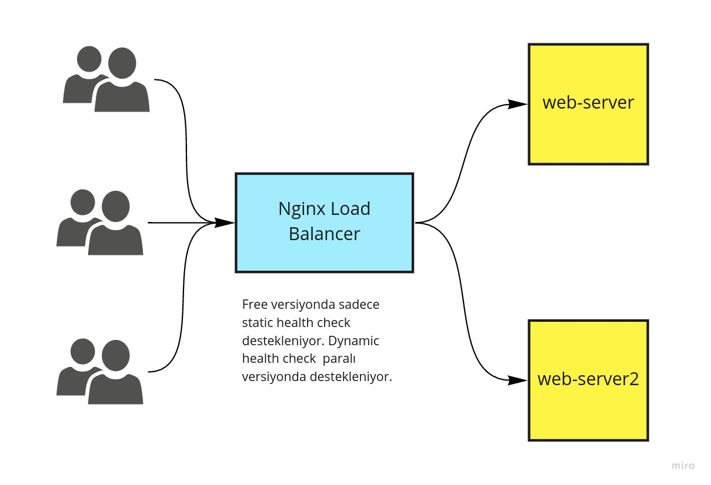

# Nginx ile Yük Dengeleme Teknikleri

Merhaba Arkadaşlar,

[Bir önceki yazımızda](1.1.reverse-proxy.md) nginx üzerinden reverse-proxy kavramını incelemiştik. Bu yazılımda yük dengeleme kavramını ve detaylarını  yine Nginx üzerinde örneklerle incelemeye devam edeceğiz.

Şekildeki gibi bir sistem kuracağız. Bunun için 3 adet Nginx Docker Image kullnacağız.



Aşağıdaki komutları kullanarak  konteynerlerimizi çalıştırıyoruz.

```
docker run -d --name web-server -p 8080:80 ubuntu/nginx
docker run -d --name web-server2 -p 8081:80 ubuntu/nginx
docker run -d --name reverse-proxy -p 80:80 ubuntu/nginx
```
daha sonra web-server ve  web-server1 konteynerlerinde default website içriklerini değiştiriyoruz. web-server body içeriğini "merhaba ben webserver" ve web-server2 body içeriğini de "merhaba ben webserver 2" olarak değiştiriyoruz.


Örneğin web-server için komutlar.

```
docker exec -it web-server bash

# giriş yaptıktan sonra alttaki dosyayı ediliyoruz

vim /var/www/html/index.nginx-debian.html
```

web-server2'de de aynısını yapıyoruz.

## Yük Dengeleme Metodları

- **Round Robin:** Varsayılarn olarka bu kullanılır. sırarıyla upstream bloğundaki sunuculara istekleri yönlendirir. Server-Weight ile birlikte kullanılırsa rastgelelik sunuclar arasında dağıtılabilir.
- **Least Connections:** Üzerinde en az iş olandan en çok olara doğru istekleri upstream bloğundaki sunuculara yönlendirir. Burada da server-weight kullanılabilir.
- **Least Time :** Nginx paralı versiyonda çalışır. isteğin yüklenme zamanına göre en hızlı olandan en yavaş olana doğru istrkleri upstream bloğundaki sunuculara yönlendirir.
- **Hash:** Sticky session benzeri bir yapı kurmak için kullanılır. Arkadaki sunucuların metaverilerine göre hash hesabı yapılır ve istekleri hep aynı hash'e yönlendirir. 
- **IP Hash (HTTP only):** Client ip adresinin ilk 3 oktetine göre her zaman aynı client için aynı sunucun cevap vereceği, garantilenir.
- **Kalıcı session (persistant session):** Bu aslında bir metod sayılmaz. Kullanıcı oturumunu algılar ve oturum süresince istekeri hep aynı sunucuya yönlendirir. Bu üzretsiz versiyonda desteklenen hash ve Ip Hash ile aynıdır fakat çalışma teknikleri (sticky cookie, sticky route, sticky learn) farklıdır.

\
**Connection Limiting** sadece paralı versiyonda destekleniyor.

## Health Check Metodları

Bedava versiyon sadece passive health check medoslarını destekliyor.

- **fail_timeout:** Sunucunun belli bir süre içinde kaç kez ulaşılmaz olması veya hata vermesi halinde istek yönelendirilmemesi gerektiğini belirler. Aynı zamanda ne kadar süre istek gönderilmeyecei de belirlenir. Varsayılan değer 10 saniyedir.  
- **max_fails:** Sunucunun kullanılamaz olarak işaretlenmesi için fail_timeout süresi boyunca gerçekleşmesi gereken başarısız denemelerin sayısını ayarlar (varsayılan 1 denemedir). 

\

**Server Slow Start:** Tekrar çalışmaya başlayan bir sunucunun bir anda çok fazla istek almasını engellemek için yavaş yavaş istekleri arttırmasını sağlayan tekniktir. örneğin slow_start=30s gibi bir değerle 30. saniyede maximum kullanıcı kabul etme seviyesine ulaşılır. 


**Active Health Check Teknikleri** 

Aktif etemek için location bloğunda health_check direktifi kullanılmalıdır. Belirli aralıklarla sunucların kontrol edilmesine dayanır. UDP, TCP ve Http protokollerininin hepsinde active health check paralı bu arada, yani http'ye özel bir durum değil.

Bir kaç farklı yolu var.
- belli bir adres verilebilir
- response içinde belli bir kelime veya pattern aranabilir
- belli bir http kodu aranabilir

## Load Balance Metodlarının Uygulanması

Öncelikle host makinamızda helloworld.com adresini 127.0.0.1 ip adresini gösterecek şekilde ayaralıyoruz.

```
sudo vim /etc/hosts

#aşağıdaki satırı ekliyoruz

127.0.0.1 helloworld.com
```


- **Round Robin**

reverse-proxy isimli konternerimiz içinde _/etc/nginx/conf.d/_ dizinine _helloworld.conf_ adında bir dosya ekeliyoruz. Bundna sonra bütün örneklerimizi bu örnek üzerinden yapıyor olacağız.  

```
vim /etc/nginx/conf.d/helloworld.conf
```

alttaki satırları içine kopyalıyoruz.


```

upstream backend{

server 172.17.0.2;
server 172.17.0.3 max_fails=3 fail_timeout=15s;
}


server {

  listen 80;

  server_name helloworld.com;

  location /  {
       


       proxy_pass http://backend; 
       proxy_set_header X-Real-IP $remote_addr;
       proxy_set_header X-Forwarded-For   $proxy_add_x_forwarded_for;
       proxy_set_header X-Forwarded-Proto $scheme;
       proxy_set_header X-Forwarded-Port  $server_port;
       proxy_set_header Host              $host;
}

}
```

değişikliklerden sonra konterynerleri yeniden başlatıyoruz.

172.17.0.3 ip'li web-server2 konteynerimize passive healht check uygulamış olduk. Ayrıca yük dengeliyici method belirtmediğimiz için round roubin çalışıyor olacak. Bu şu anlama geliyor, istekler sırasıyla web-server ve web-server2'ye gidecek ancak olurda web-server2 üzerinde 15 saniye içinde 3 hata olursa ozaman istkerler tamamen web-server koneynerine yönlencek demektir.

test etmek için tarayıcınızda helloworld.com adresini çağırdığınızda ekrana sırasıyla "merhaba ben webserver" ve "merhaba ben webserver 2" geldiğini görebilirsiniz.

conf dosyamızda web-server2 için 15sn içinde 3 hata gelirse kullanım dışı olacağını  belirtmiştik bunu test etmek için web-server2 koneynerini durduyoruz.

```
docker container stop web-server2
```
konteyeneri durdurduktan sonra helloworld.com adresini tarayıcıdan devamlı çağızdığımızda artık bütün isteklerin web.server konteynerine gittiğini görebilirsiniz.

tekrar çalıştırıp test edersek yçnlendirmenin sırayla gittiği görebiliriz.


- **Weighted Round Robin**

helloworld.cpnf dosyamızdaki web-server2 konteyneri ile ilgil satırı aşağıdaki gibi değiştiriyoruz.

```
server 172.17.0.3 max_fails=3 fail_timeout=15s weight=3;
```

Eğer değer verilmezse varsayılan değer 1'dir. Bu durumda web-server değeri 1 olarak kalacaktır. Değişiklikte sonra nginx servisini restart edip tarayıcıda test ediyoruz. Test ederken görüleceği üzere web-server konteynerine 1 kez gidiyorsak web-server2 konteynerine 3 kez gidiyor olacağız.

- **Least-Connection**

Bunu için helloworld.conf dosyasında up stream bloğunu şu şekilde değiştiriyoruz.

```
upstream backend{
least_conn;
server 172.17.0.2;
server 172.17.0.3;
}

```

- **Ip Hash**

Bunu için helloworld.conf dosyasında up stream bloğunu şu şekilde değiştiriyoruz.

```
upstream backend{
ip_hash;
server 172.17.0.2;
server 172.17.0.3;
}

```
- **Server Slow-Start**


Bunu için helloworld.conf dosyasında up stream bloğunu şu şekilde değiştiriyoruz.

```
upstream backend{
server 172.17.0.2;
server 172.17.0.3 slow_start=30s;
}

```


Bu teknikler beraber de kullanılaiblir. Yani passive veya burada değinmedik ama active health check ile birlikte load balance metdolarından herangi biri beraber kullanılabilir. 


Örnek olararak least connection ile birlikte passive health check beraber kullanılmış.


```
```
upstream backend{
least_conn;
server 172.17.0.2;
server 172.17.0.3 max_fails=3 fail_timeout=15s weight=3;
}
```


Bir sonraki yazımız Nginx ile birlikte statik içeriklerin yayınlanması hakkında olacak. faydalı okumalar...


**Kaynaklar**
- [Nginx Resmi Sayfası - Guide](https://docs.nginx.com/nginx/admin-guide/load-balancer/http-load-balancer/)
- [Nginx Resmi Sayfası = İki sayfalık load balancer dokümanı](https://www.nginx.com/products/nginx/load-balancing/)


