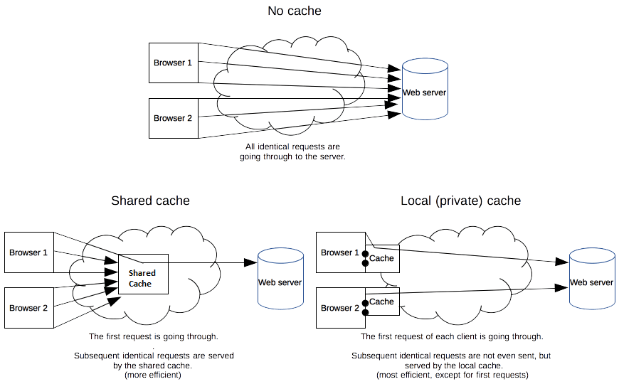

# Nginx Private Cache Uygulamaları 

Merhaba arkadaşlar, 

Bu yazımızda HTTP Cache ve Proxy Cache konusuna değineceğiz. Konuyu pekiştirmek için de Nginx ile uygulamalar yapacağız.

Alta başlıklarımız şu şekilde olacak.

- Cache Çeşitleri
- Cache Kontrol Teknikleri
- Cache Süresi (Tazeliği)
- Static ve Dinamik Cache
- Nginx ile Örnek Uygulamalar

## Cache Çeşitleri

Temelde iki çeşit http cache var.

- **Private:** Kişiye özel cache'lemeyi ifade eder. Tarayıcıların cache'leri buna örnektir. Sunucu tarafından içerikler tarayıcıya gönderilirken Cache-Control direktifleri ile tarayıcının cache'leme özellikleri 
- **Shared:** Herkes için aynı olan içeriklerin oluşturulma maliyetini aza indirmek için ara bir sunucuda (proxy cache sunucusunda) tutulmasıdır. Nxinx'de Proxy_pass ile ileride detaylarını göreceğimiz "proxy_cache" directive'i shared cache kullanmamıza olanak tanır. CDN'lerde buna bir örnektir.


Alttaki şekilde bu örnekleri görebilirsiniz.


[Kaynak:Cache Çeşitleri](https://developer.mozilla.org/en-US/docs/Web/HTTP/Caching)

## Cache Kontrol Teknikleri

Burada değineceğimiz teknikler doğrudan Nginx ile ilgili değil aslında. Ancak Nginx'in de desteklediği standartlar olduğu için bilmek gerekiyor.

Burada iki türlü directive karşımıza çıkıyor. 
- **Cache Request Directive:** Client'ın HTTP istekleri (request) için kullanılır.
- **Cache Responce Directive:** Server'ın HTTP cevapları (repsonse) için kullanılır.

### Cache Request Directives

- Cache-Control: max-age=\<seconds\>
- Cache-Control: max-stale[=\<seconds\>]
- Cache-Control: min-fresh=\<seconds\>
- Cache-Control: no-cache
- Cache-Control: no-store
- Cache-Control: no-transform
- Cache-Control: only-if-cached
- If-Modified-Since: Mon, 28 Jun 2021 21:06:28 GMT (örnek tarih formatı)
- If-None-Match: Hashtag olur genellikle

Arada bir Nginx gibi proxy olursa onun üzerinden yada sunucu taraflı bir programa dili ile kullanılıyorsa client'dan gelen bu bilgiler değiştirilebilir.

Nginx arada proxy olarak kullanıldığında proxy_set_header directive'i web-server'a gönderilen içeriğin header'ını düzenleyebilir yada add_header directive'i ile yeni key'ler ekleyebilir.


### Cache Response Directives

- Cache-Control: must-revalidate
- Cache-Control: no-cache
- Cache-Control: no-store
- Cache-Control: no-transform
- Cache-Control: public
- Cache-Control: private
- Cache-Control: proxy-revalidate
- Cache-Control: max-age=\<seconds\>
- Cache-Control: s-maxage=\<seconds\>
- ETag: Hashtag olur genellikle
- Last-Modified: Mon, 28 Jun 2021 21:06:28 GMT (örnek tarih formatı)

\
Sırasıyla Directive'leri inceleyelim

- **Cacheability (Cache Edilebilirlik)**
    - public: Tarayıcı yada herhangi bir cache mekanizması tarafından cache'lenebilir demektir. Bunu kullanırken dikkat edilmelidir. Cache'lenmesini asla istemediğimiz içerikleri için  bunu kullanmamalıyız.
    - no-cache: Bu directive herhangi bir cache sisteminin içeriği cache'leyip cache'lememe konusunda kendi insiyatifine bırakıldığını ifade eder. 
    - no-store: cache'lemenin kesinlikle olaması istenildiğinde kullanılacak directive'dir.

## Cache Süresi (Tazeliği)

- max-age: İçeriğin ne kadar süre cache'denkullanılcaağını belirler, içeriğin halen bayat (stale)olmadığını belirtir. Yani bu süreden sonra orjinal içeriğin tekrar kaynaktan alınması gerektiğini belirtmiş oluyoruz.
- s-maxage: Üstteki max-age değerini iptal eder. Ancak private cache'ler etkilenmez. 
- max-stale: eskimiş içerikler için kabul edilebilir süreyi belirtir. Buradaki saniye değerinden eski değerler için içerik yok kabul edilir.
- min-fresh: En az saniye cinsinden belirtilen süre kadar taze kalabilecek içeriklerin kabul edileceğini belirtilir.
- stale-while-revalidate: Bir istek aynı anda hem client tarafından talep edildiyse hem de aynı anda da cache'lenen içeriğin güncelliği kontrol ediliyorsa eski içerik cache'den verilir ancak sunucudan gelen içerik daha cache'dekinden daha yeniyse cache yenilenir.

    örneğin şu şekilde (_Cache-Control: max-age=1, stale-while-revalidate=5_) yapılmış cache control şunu ifade eder. Eğer 1 sn içinde devamlı istek yapılıyorsa yani 2 istek arası hiçbir zaman 1 saniyeyi geçmiyorsa cache'deki veri tazedir. Ancak1-5 arasında yapılacak bir istekte validation da yapılıyorsa yani paralelde denk geldiyse o esnada eski olup olamamasına bakılmaksızın eski içerik gönderilir. Validation sonrasında ise veri yeni gelenden eskiyse güncellenir.  
- stale-if-error: Kontrol başarısız olursa, istemcinin eski bir yanıtı kabul edeceğini belirtir. Saniye değeri ise, istemcinin ilk sona erme süresinden sonra eski yanıtı ne kadar süreyle kabul edeceğini gösterir.


### Lab Ortamının Hazırlanması


Örneklerimizde aşağıdaki gibi bir topoloji kullanıyor olacağız. Private cache için aslında araya proxy koymamıza gerek yok. Ancak ileride yapacağımız shared cache için buna benzer bir topolojiye ihtiyacımız olacağı için topolojiyi baştan kurmak vakit kazandıracaktır.

Ayrıca böyle bir topolojide içerik Cache-Control direktifleri doğrudan web-server üzerinde de yapılabilir. Proxy üzerinde yapmak arkaya sunucu eklediğinizde tekrar iş yapmak zorunda bırakmayacaktır. Tabii ki ihtiyaca göre kurgunuz da değişecektir. 


Web-server nginx konteyneri olarak çalıştıracağız ve html klasörüne statik içerikleri oluşturarak uygulamalarımızı yapacağız.

Aşağıdaki komutları kullanılarak konteynerleri çalıştırabilirsiniz.

```
docker run -d --name web-server -p 8080:80 ubuntu/nginx
docker run -d --name reverse-proxy -p 80:80 ubuntu/nginx
```
Önceki yazılarımızda olduğu gibi yine host makinemizde host dosyasına helloworld.com adresini 127.0.0.1 olarak ayarlıyoruz.

Daha sonra alttaki komutu doğrudan reverse-proxy üzerinde çalıştırarak proxy'mizi ayarlıyoruz.

```bash
cat << EOF >> /etc/nginx/conf.d/helloworld.conf 

upstream backend{

server 172.17.0.2; # web-server konteynerinin ip si sizde farklı olabilir
}

server {
  listen 80;
  server_name helloworld.com;
  location /  {
       proxy_pass http://backend;
       proxy_set_header X-Real-IP $remote_addr;
       proxy_set_header X-Forwarded-For   $proxy_add_x_forwarded_for;
       proxy_set_header X-Forwarded-Proto $scheme;
       proxy_set_header X-Forwarded-Port  $server_port;
       proxy_set_header Host              $host;
    }
}
EOF

```

Daha sonra web-server konteynerinde _/var/www/html#_ dizinine images,  jscript ve css  adında üç klasör oluşturuyoruz.

Daha sonra 
- jscript klasörüne iki adet içeriğinin ne olduğu önemli olmayan 1.js ve 2.js adında iki adet javascript dosyası, 
- css klasörüne  iki adet 1.css ve 2.css adında iki adet css dosyası 
- ve image klasörüne de ikişer adet (1.jpg, 2.jpg,1.png ve 2.png) adında jpg ve png  uzantılı 
dosya oluşturuyoruz.

İşimiz bittikten sonra iki konteyneri de restart ediyoruz. Lab ortamımız artık hazır.

### Private Cache Uygulamaları

Amacımız browser'a bazı direktifleri vererek cache'leme özelliklerini kontrol etmek.

İlk olarak host makinamızda curl ile test yapıyoruz. Görüldüğü üzere cache kontrol ile ilgili herhangi bir şey yok.  

```bash
curl -I http://helloworld.com/images/1.png

# sonuç
HTTP/1.1 200 OK
Server: nginx/1.18.0 (Ubuntu)
Date: Mon, 28 Jun 2021 21:16:57 GMT
Content-Type: image/png
Content-Length: 2256116
Connection: keep-alive
Last-Modified: Mon, 28 Jun 2021 21:10:10 GMT
ETag: "60da3ab2-226cf4"
Accept-Ranges: bytes
```

Şimdi sırasıyla yukarıda bahsettiğimiz cache tekniklerini uygulayalım.

- **no-store cache**
Bu directive ile amacımız içeriğin hiç bir yerde cache'lenmemesini sağlamak.

reverse-proxy konteynerinde /etc/nginx/conf.d/helloworld.conf dosyasında ikinci bir location bloğu ekliyoruz.

```bash
  location ~ \.(png){
       
       proxy_pass http://backend;
       add_header Cache-Control no-store;
}
```

Nginx servisini restart ettikten sonra curl ile tekrar test ettiğimizde alttaki sonucu göreceğiz. En satıra dikkat edin.

```bash
curl -I http://helloworld.com/images/1.png

#sonuç
HTTP/1.1 200 OK
Server: nginx/1.18.0 (Ubuntu)
Date: Mon, 28 Jun 2021 22:00:54 GMT
Content-Type: image/png
Content-Length: 2256116
Connection: keep-alive
Last-Modified: Mon, 28 Jun 2021 21:10:10 GMT
ETag: "60da3ab2-226cf4"
Accept-Ranges: bytes
Cache-Control: no-store
```

- **no-cache**
İçeriğin istenirse cache'lenebilceğini ifade eder.

reverse-proxy konteynerinde /etc/nginx/conf.d/helloworld.conf dosyasında üçüncü bir location bloğu ekliyoruz.

```bash
  location ~ \.(jpg){
       
       proxy_pass http://backend;
       add_header Cache-Control no-cache;
}
```

Kontrol ettiğimizde no-cache in eklendiğini görebiliriz. 

```bash
curl -I http://helloworld.com/images/1.jpg

#sonuç
HTTP/1.1 200 OK
Server: nginx/1.18.0 (Ubuntu)
Date: Tue, 29 Jun 2021 06:52:54 GMT
Content-Type: image/jpeg
Content-Length: 338719
Connection: keep-alive
Last-Modified: Mon, 28 Jun 2021 21:06:28 GMT
ETag: "60da39d4-52b1f"
Accept-Ranges: bytes
Cache-Control: no-cache

```

Ancak bunun bize faydası nedir? yada hakikaten browser cache'ledi mi? emin olabilmek için browser üzerinden kontrol etmemiz gerekiyor.

Bunun için Chrome developer tools'u açıp network tab'ında iken alttaki iki adresi yenilediğinizde png olanın devamlı 200 kodu ile sunucudan talep edilirken jpg olanın ilk yüklemede sonra 304 kodu ile çalıştığını yani dosya sunucuda değişmediği için yüklenmediğini görebilirsiniz.

- http://helloworld.com/images/1.jpg (no-cache)
- http://helloworld.com/images/1.png (no-store)

cache de tutulacak süreyi belirlemek için en çok kullanılan yöntemlerden biri max-age.


- **max-age**
Saniye cinsinden belirtilen süre kadar cache den okunur.

reverse-proxy konteynerinde _/etc/nginx/conf.d/helloworld.conf_ dosyasında dördüncü bir location bloğu ekliyoruz. Daha sonra konteyneri restart ediyoruz.

```bash
location = /images/2.jpg {

       proxy_pass http://backend;
       add_header Cache-Control "no-cache  max-age=10";
}

```

Cache'in maksimum 10 saniye geçerli olacağını 10 saniyeden sonra sunucudan alınması gerektiğini söylemiş olduk. Ancak 10 saniye sonra 200 koduyla içerik tekrar çekilecek anlamına gelmiyor. Bu haliyle eğer sunucudaki versiyon değişmediyse 304 kodu gelecek ve yine cache'den çalışacak demektir. Tabii ki sunucuda dosya değişirse bu durumda 200 koduyla dosya yeniden yüklenir.

Burada bir de şunu bilmek gerekiyor Request-Header'larda Cache-Control ile yönetilmeyen alttaki iki direktif daha var.

- If-Modified-Since
- If-None-Match

Biz her ne kadar max-age versek dahi If-Modified-Since dosyanın değiştirilme tarihini, If-None-match ise Response-Header' da gelen Etag ile kendi değeri arasındaki farkı kontrol ederek eğer dosya değiştiyse max-age zamanı dolmasa dahi dosyayı tekrar 200 kodu ile çekecektir.

## Kaynaklar
- [Mozilla Web HTTP Cache](https://developer.mozilla.org/en-US/docs/Web/HTTP/Caching)
- [Mozilla Cache Control](https://developer.mozilla.org/en-US/docs/Web/HTTP/Headers/Cache-Control)
- [stale-while-revalidate](https://web.dev/stale-while-revalidate/)
