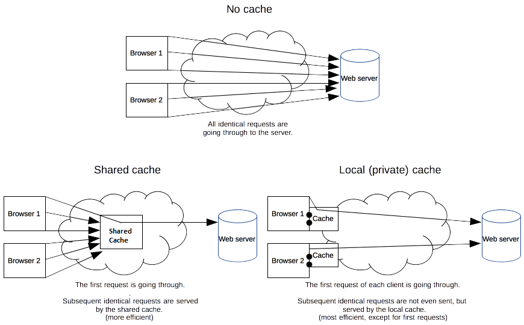

# Nginx Private Cache Uygulamaları 

Merhaba arkadaşlar, 

Bu yazıda konumuz HTTP Cache ve Proxy Cache konusuna değineceğiz. Konuyu pekiştirmek için de Nginx ile uygulamalar yapacağız.

Alta başlıklarımız şu şekilde olacak.

- Cache Çeşitleri
- Cache Kontrol Teknikleri
- Cache Süresi (Tazeliği)
- Static ve Dinamik Cache
- Nginx ile Örnek Uygulamalar

## Cache Çeşitleri

Temelde iki çeşit http cache var.

- **Private:** Kişiye özel cache'lemeyi ifade eder. Tarayıcıların cache'leri buna örnektir. Sunucu tarafından içerikler tarayıcıya gönderilirken Cache-Control direktifleri ile tarayıcının cache'leme özellikleri 
- **Shared:** Herkes için aynı olan içeriklerin oluşturulma maliyetini aza indirmek için ara bir sunucuda (proxy cache sunucusunda) tutulmasıdır. Nxinx'de Proxy_pass ile ileride detaylarını göreceğimiz "proxy_cache" directive'i shared cache kullanmamıza olanak tanır. CDN'lerde buna bir örnektir.


Alttaki şekilde bu örnekleri görebilirsiniz.


[Kaynak:Cache Çeşitleri](https://developer.mozilla.org/en-US/docs/Web/HTTP/Caching)

## Cache Kontrol Teknikleri

Burada değineceğimiz teknikler doğrudan Nginx ile ilgili değil aslında. Ancak Nginx HTTP'nin standartlarına uygun bir mekanizma sunduğu için bu teknikleri bilememiz gereriyor.

Burada iki türlü directive karşımızıa çıkıyor. 
- **Cache Request Directive:** Client'ın HTTP istekleri (request) için kullanılır.
- **Cache Responce Directive:** Server'ın HTTP cevapları (repsonse) için kullanılır.

### Cache Request Directives

- Cache-Control: max-age=\<seconds\>
- Cache-Control: max-stale[=\<seconds\>]
- Cache-Control: min-fresh=\<seconds\>
- Cache-Control: no-cache
- Cache-Control: no-store
- Cache-Control: no-transform
- Cache-Control: only-if-cached
- If-Modified-Since: Mon, 28 Jun 2021 21:06:28 GMT (örnek tarih formatı)
- If-None-Match: Hastag olur genellikle

Arada bir proxy olursa client'dan gelen bu bilgiler değiştirilebilir. Yada sunucu taraflı bir programlma dili kullanılıyorsa değiştirilebilir. 

Nginx arada proxy olarak kullanıldığında proxy_set_header directive'i web-server'a gönerilen içerğin header'ını düzenleyebilir.


### Cache Response Directives

- Cache-Control: must-revalidate
- Cache-Control: no-cache
- Cache-Control: no-store
- Cache-Control: no-transform
- Cache-Control: public
- Cache-Control: private
- Cache-Control: proxy-revalidate
- Cache-Control: max-age=\<seconds\>
- Cache-Control: s-maxage=\<seconds\>
- ETag: Hastag olur genellikle
- Last-Modified: Mon, 28 Jun 2021 21:06:28 GMT (örnek tarih formatı)

nginx ile add_header directive'i ile sunucudan istemciye gönderilen içeriğin header bilgileri düzenlenebilir.

\
Sırasıyla Directive'leri inceleyelim

- **Cacheability (Cache Edilebilirlik)**
    - public: Tarayıcı yada herhangi bir cache mekanizması tarafından cache'lenebilir demektir. Bunu kullanırken dikkat edilmelidir. Cache'lenmesini asla istemediğimiz içerikleri için  bunu kullanmamamlıyız.
    - no-cache: Bu directive herhangi bir cache sisteminin içeriği cache'leyip cache'lememe konusunda kendi insiyatfine bırakıldığını ifade eder. 
    - no-store: cache'lemenin kesinlikle olaması istenildiğinde kullanılacak directive'dir.

## Cache Süresi (Tazeliği)

- max-age: İçeriğin ne kadar süre cache'denkullanılcaağını belirler, içeriğin halen bayat (stale)olmadığını belirtir. Yani bu süreden sonra orjinaliçeriin tekrar kaynaktan alınması gerektiğinibelirtmiş oluyoruz.
- s-maxage: Üstteki max-age değerini iptal eder. Ancakprivate cache'ler etkilenmez. 
- max-stale: eskimiş içerikler için kabül edilebilir süreyi belirtir. Buradaki saniye değerinden eskideğerler için içerik yok kabül edilir.
- min-fresh: En az saniye cinsinden belirtilen sürekadar taze kalabilecek içeriklerin kabül edileceğibelirtilir.
- stale-while-revalidate: Bir istek aynı anda hemclient tarafından talep edildiyse hem de aynı anda dacache'lenen içeriğin güncelliği kontrol ediliyorsaeski içerik cache'den verilir ancak sunucudan geleniçerik daha cache'dekinden daha yeniyse cacheyenilenir.

    örneğin şu şekilde (_Cache-Control: max-age=1, stale-while-revalidate=5_) yapılmış cache controlşunu ifade eder. Eğer 1 sn içinde devamlı istekyapılıyorsa yani 2 istek arası hiçbir zaman 1saniyeyi geçmiyosa cache'deki veri tazedir. Ancak1-5 arasıdna yapıalcak bir istekde validation dayapılıyorsa yani paralelde denkgeldiyse o esnadaeski olup olamamsına bakılmaksızın eski eskiiçerik gönderilir. Validation sonrasnda ise veriyeni gelenden eskiyse güncellenir.  
- stale-if-error: Kontrol başarısız olursa, istemcinineski bir yanıtı kabul edeceğini belirtir. Saniyedeğeri ise, istemcinin ilk sona erme süresinden sonraeski yanıtı ne kadar süreyle kabul edeceğini gösterir.

Örneklerimizde aşağıdaki gibi bir topoloji kullanıyor olacağız. Private cache için aslında araya proxy koymamıza gerek yok. Ancak ileride yapacağımız shared cache için buna bener bir topolojiye ihtiyacımız olacağı için böyle bir topolojiyi baştan kurmak vakit kazandıracaktır.

Ayrıca böyle bir topolojide içerik Cache-Control direktifleri doğrudan web-server üzerinde de yapılabilir. Proxy üzerinde yapmak arkaya sunucu eklediğinizde tekrar iş yapmak zorunda bırakmayacaktır. Tabiiki ihtiyaca göre kurgunuzda değişecektir. 


Web-server nginx konteyneri olarak çalıştıracağız ve html klasörüne statik içerikleri oluşturarak uygulamalarımızı yapacağız.

### Lab Oratamının Hazırlanması

Aşağıdaki komutları kullanılarak konteynerleri çalıştırabilirsiniz.

```
docker run -d --name web-server -p 8080:80 ubuntu/nginx
docker run -d --name reverse-proxy -p 80:80 ubuntu/nginx
```
Önceki yazılarımızda olduğu gibi yine host makinamızda host dosyasına helloworld.com adresini 127.0.0.1 olarak ayarlıyoruz.

Daha sonra alttaki komutu doğrudan reverse-proxy üerinde çalıştırarak proxy'mizi ayaralıyoruz.

```
cat << EOF >> /etc/nginx/conf.d/helloworld.conf 

upstream backend{

server 172.17.0.2; # web-server konteynereinin ip si sizde farklı olabilir
}

server {
  listen 80;
  server_name helloworld.com;
  location /  {
       proxy_pass http://backend;
       proxy_set_header X-Real-IP $remote_addr;
       proxy_set_header X-Forwarded-For   $proxy_add_x_forwarded_for;
       proxy_set_header X-Forwarded-Proto $scheme;
       proxy_set_header X-Forwarded-Port  $server_port;
       proxy_set_header Host              $host;
    }
}
EOF

```

Daha sonra web-server konteynerinde _/var/www/html#_ dizinine images,  jscirpt ve css  adında üç klasör oluşturuyoruz.

Daha sonra 
- jscript klasörüne iki adet içeriğinin ne olduğu önemli olmayan 1.js ve 2.js adında iki adet javascript dosyası, 
- css klasörüne  iki adet 1.css ve 2.css adında ikişadet css dosyası 
- ve image klasörüne de ikişer adet (1.jpg, 2.jpg,1.png ve 2.png) adında jpg ve png  uzantılı 
dosya oluşturuyoruz yada internetten download ediyoruz.

Bütün işimiz bittikten sonra iki konteyneri de restart ediyoruz. Lab oramımız artık hazır.

### Private Cache Uygulamaları

Amacımız browser'a bazı direktifleri vererek cache'leme özelliklerini kontrol etmek.

İlk olarak host makinamızda curl ile test yapıyoruz. Görüldüğü üzere cache kontrol ile ilgili herhangi birşey yok.  

```
curl -I http://helloworld.com/images/1.png

HTTP/1.1 200 OK
Server: nginx/1.18.0 (Ubuntu)
Date: Mon, 28 Jun 2021 21:16:57 GMT
Content-Type: image/png
Content-Length: 2256116
Connection: keep-alive
Last-Modified: Mon, 28 Jun 2021 21:10:10 GMT
ETag: "60da3ab2-226cf4"
Accept-Ranges: bytes
```

Şimdi sırarıyla yukarıda bahsettiğimiz cache tekniklerini uygulayalım.

- **no-store cache**
Bu directive ile amacımız içeriğin hiç biryerde cache'lenmemesini sağlamak.

reverse-proxy konteynerinde /etc/nginx/conf.d/helloworld.conf dosyasında ikinci bir location bloğu ekliyoruz.

```
  location ~ \.(png){
       
       proxy_pass http://backend;
       add_header Cache-Control no-store;
}
```
nginx servisini restart ettikten sonra curl ile tekrar test ettiğimizde alttaki sonucu bulmuş olacağız.

```
curl -I http://helloworld.com/images/1.png

HTTP/1.1 200 OK
Server: nginx/1.18.0 (Ubuntu)
Date: Mon, 28 Jun 2021 22:00:54 GMT
Content-Type: image/png
Content-Length: 2256116
Connection: keep-alive
Last-Modified: Mon, 28 Jun 2021 21:10:10 GMT
ETag: "60da3ab2-226cf4"
Accept-Ranges: bytes
Cache-Control: no-store
```

- **no-cache**
içeriğin istenirse cache'lenebilceğini ifade eder.

reverse-proxy konteynerinde /etc/nginx/conf.d/helloworld.conf dosyasında üçüncü bir location bloğu ekliyoruz.

```
  location ~ \.(jpg){
       
       proxy_pass http://backend;
       add_header Cache-Control no-cache;
}
```

kontol ettiğimizde no-cache in eklendiğini görebiliriz. 

```
curl -I http://helloworld.com/images/1.jpg
HTTP/1.1 200 OK
Server: nginx/1.18.0 (Ubuntu)
Date: Tue, 29 Jun 2021 06:52:54 GMT
Content-Type: image/jpeg
Content-Length: 338719
Connection: keep-alive
Last-Modified: Mon, 28 Jun 2021 21:06:28 GMT
ETag: "60da39d4-52b1f"
Accept-Ranges: bytes
Cache-Control: no-cache

```

Ancak bunun bize faydası nedir? yada hakikaten browser cache'ledi mi? emin olabilmek için browser üzerinden kontrol etmemiz gerekiyor.

Bunun için Chrome developer tools'u açıp network tabından iken alttaki iki adresi yenilediğinizde png olanın devamlı 200 kodu ile sunucudan talep edilirken jpg olanın ilk yüklemede sonra 304 kodu ile çalıştığını yani dosya sunucuda değişmediği için yüklenmediğini görebilirsiniz.

- http://helloworld.com/images/1.jpg (no-cache)
- http://helloworld.com/images/1.png (no-store)

cache de tutulacak süreyi belirlemek için en çok kullanılan yöntemlerden biri max-age.


- **max-age**
Saniye cinsinden belirtlen süre kadar cache den okunur.

reverse-proxy konteynerinde _/etc/nginx/conf.d/helloworld.conf_ dosyasında dördüncü bir location bloğu ekliyoruz. Daha sonra konteyneri restart ediyoruz.

```
location = /images/2.jpg {

       proxy_pass http://backend;
       add_header Cache-Control "no-cache  max-age=10";
}

```
cache'in maksimum 10 geçerli olacağını 10 saniyeden sonra sunucudan alınması gerektiğini söylemiş olduk. Ancak 10 saniye sonra 200 koduyla içerik tekrar çekilecek anlamına gelmiyor. Bu haliyle eğer sunucudaki versiyon değişmediyse 304 kodu gelecek ve yine cache'den çalışacak demektir. Tabii ki sunucuda dosya değişirse bu durumda 200 koduyla dosya yeniden yüklenir.

Burada bir de şunu bilmek gerkiyor Reques-Header'larda Cache-Control ile yönetilmeyen alttaki iki direktif daha var.

- If-Modified-Since
- If-None-Match

Biz her ne kadar max-age versek dahi If-Modified-Since dosyanın değiştirilme tarihini, If-None-match ise Response-Header' da gelen Etag ile kendi değeri arasındaki farkı kontrol ederek eğer dosya değiştiyse max-age zamanı dolmasa dahi dosyayı tekrar 200 kodu ile çekecektir.

## Kaynaklar
- [Mozilla Web HTTP Cache](https://developer.mozilla.org/en-US/docs/Web/HTTP/Caching)
- [Mozilla Cache Control](https://developer.mozilla.org/en-US/docs/Web/HTTP/Headers/Cache-Control)
- [stale-while-revalidate](https://web.dev/stale-while-revalidate/)
