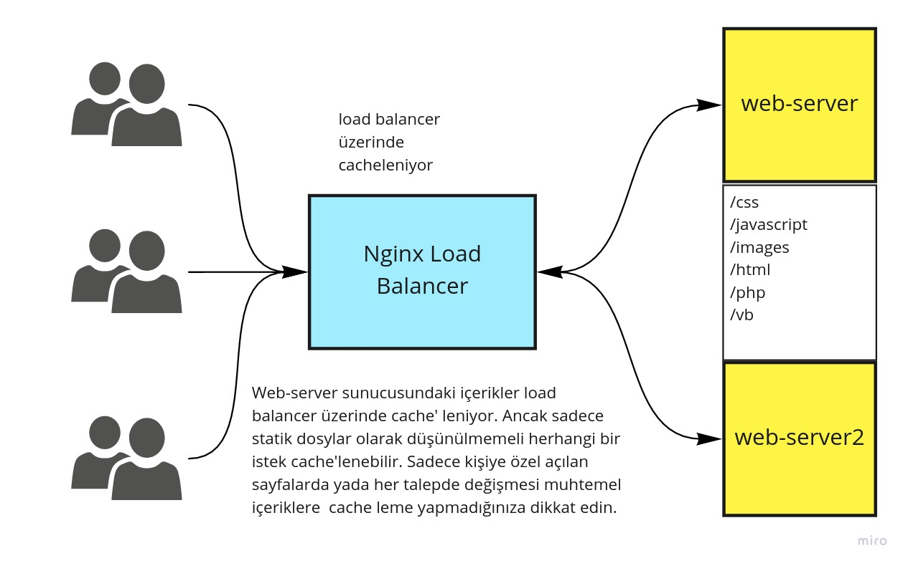

# Nginx Shared Cache Uygulamaları 

Merhaba arkadaşlar, 


## Nginx ile Puplic (Shared) Cache Uygulamaları

Nginx shared cache oluşturabilmek için proxy_pass üzerinden proxy_cache directive'leri sunar.



[Nginx Resmi dokümanlarına](https://nginx.org/en/docs/http/ngx_http_proxy_module.html) bakacak olursanız alttaki directive'leri görebilirsiniz.

- proxy_cache
- proxy_cache_background_update
- proxy_cache_bypass
- proxy_cache_convert_head
- proxy_cache_key
- proxy_cache_lock
- proxy_cache_lock_age
- proxy_cache_lock_timeout
- proxy_cache_max_range_offset
- proxy_cache_methods
- proxy_cache_min_uses
- proxy_cache_path
- proxy_cache_purge
- proxy_cache_revalidate
- proxy_cache_use_stale
- proxy_cache_valid
- proxy_no_cache
- proxy_temp_path


Öncelikle hızlıca listenin üzerinden geçelim.

- **proxy_cache**


Cache'leme yapmak için kullanılacak shared memory bölgesini tanımlar.

```
 server {
    location / {
      proxy_pass http://example.net;
      proxy_cache my-cache;
    }
```

- **proxy_cache_background_update**

Expire olan içeriklerin arka tarafta cache'leme yapılmasını sağlar. İstenmiyorsa off yapıılmalıdır. 

```
 server {
    location / {
      proxy_pass http://example.net;
      proxy_cache my-cache;
      proxy_cache_background_update on;
    }
```

- **proxy_cache_bypass**

String olarak belirtilen içerikler cache'lenmez. Mesela client'in talep ettiği içerikte Cache-Control değerlerine göre içerik cache'den değil doğrudan web sunucudan iletilir.  proxy_no_cache ile aynı işi yapar.

```
 server {
    location / {
      proxy_pass http://example.net;
      proxy_cache my-cache;
      proxy_cache_background_update on;
      proxy_cache_bypass $http_cache_control
    }
```


- **proxy_cache_convert_head**

HTTP protokolünde yapılan HEAD istekerinin cache'lenebilmes için Nginx GET metoduna çevirir bunu kapatmak veya açmak için kullanılır.

```
 server {
    location / {
      proxy_pass http://example.net;
      proxy_cache my-cache;
      proxy_cache_background_update on;
      proxy_cache_bypass $http_cache_control
      proxy_cache_convert_head off;
    }
```

- **proxy_cache_key**

İçeriği cache'lerken uniq bir key vermek için kullanılır. Aşağıdaki bir örnek yani böyle olacak diye bir kural yok herhangi bir string ifade olabilir.
default değer _proxy_cache_key $scheme$proxy_host$request_uri;_ şeklindedir.

Bu directive sadece server bloğu içinde değil aynı zamanda dışarıda global olrak da tanımlanabilir.


```
 server {
    location / {
      proxy_pass http://example.net;
      proxy_cache my-cache;
      proxy_cache_background_update on;
      proxy_cache_bypass $http_cache_control
      proxy_cache_convert_head off;
      proxy_cache_key "$scheme$request_method$host$request_uri$is_args$args";
    }
```


- **proxy_cache_lock**

İçeriğin yeniden cache'lenmesi gerektiinde sisteme sadece bir isteğin girmesini sağlamak için kullanılır. "on" yapılırsa sadece bir istek web sunucusuna ulaşır diğerleri bekler, cache oluştukta sonra bekleyenler cache'den okur.

_proxy_cache_lock_age_ lock süresini ifade eder. _proxy_cache_lock_timeout_ ise timeout süresni belirler.
```
 server {
    location / {
      proxy_pass http://example.net;
      proxy_cache my-cache;
      proxy_cache_background_update on;
      proxy_cache_bypass $http_cache_control
      proxy_cache_convert_head off;
      proxy_cache_key "$scheme$request_method$host$request_uri$is_args$args";
      proxy_cache_lock on;
    }
```

- **proxy_cache_max_range_offset**

içerik burada belirtilen byte noyutundan fazla ise bu içerik cache'lenmeyecek doğrudan web sunucusuna yönlendirilecektir. Aşağıdaki çrnekte 1 MB üstü istekler için sunucuya yönlendirme yapılır.
```
 server {
    location / {
      proxy_pass http://example.net;
      proxy_cache my-cache;
      proxy_cache_background_update on;
      proxy_cache_bypass $http_cache_control
      proxy_cache_convert_head off;
      proxy_cache_key "$scheme$request_method$host$request_uri$is_args$args";
      proxy_cache_lock on;

      proxy_cache_max_range_offset 1000000;
    }
```


- **proxy_cache_methods**

HTTP protokolünde yer alan event'lerdenm hangilerinin cache'lenecğibi belirtir. GET ve HEAD zaten doğrudan varsayılan olarak vardır. ancak dokümanlar yine de açıkça belirtilmesi gerekitiği söylüyot. Diğerleri de eklenebilir. A
```
 server {
    location / {
      proxy_pass http://example.net;
      proxy_cache my-cache;
      proxy_cache_background_update on;
      proxy_cache_bypass $http_cache_control
      proxy_cache_convert_head off;
      proxy_cache_key "$scheme$request_method$host$request_uri$is_args$args";
      proxy_cache_lock on;
      proxy_cache_max_range_offset 1000000;
      proxy_cache_methods GET HEAD POST;
    }
```


- **proxy_no_cache**

Hangi isteğin cache'lenmeyeceğini ifade etmek için kullanılır. proxy_cache_bypass ile aynı işi yapar.

```
 server {
    location / {
      proxy_pass http://example.net;
      proxy_cache my-cache;
      proxy_cache_background_update on;
      proxy_cache_bypass $http_cache_control
      proxy_cache_convert_head off;
      proxy_cache_key "$scheme$request_method$host$request_uri$is_args$args";
      proxy_cache_lock on;
      proxy_cache_max_range_offset 1000000;
      proxy_cache_methods GET HEAD POST;
      proxy_no_cache $http_pragma $http_authorization;
    }
```


- **proxy_cache_min_uses**

Kaç istekten sonra isteğin cache'leneceğini belirtir.
```
 server {
    location / {
      proxy_pass http://example.net;
      proxy_cache my-cache;
      proxy_cache_background_update on;
      proxy_cache_bypass $http_cache_control
      proxy_cache_convert_head off;
      proxy_cache_key "$scheme$request_method$host$request_uri$is_args$args";
      proxy_cache_lock on;
      proxy_cache_max_range_offset 1000000;
      proxy_cache_methods GET HEAD POST;
      proxy_no_cache $http_pragma $http_authorization;
      proxy_cache_min_uses 10;
    }
```

- **proxy_cache_path**

Öncelikle şunu belirtelim bu özellik Plus yani paralı versiyonda var. [Kaynak](https://www.nginx.com/products/nginx/compare-models/)

Tek cümleyle ifade etmek aslında mümkün değil. Yani cache'in disk üzerindeki yolunu ifade eder diyebliriz ancak bunu yaparken daha bir işi tamamlar ve birçok parametreyi de kullanır. Syntax'ine bakacak olursak ne kadar dolu olduğunu görebiliriz. 

Server bloğu içinde değil aynı zamanda dışarıda global olrak da tanımlanır.

```
proxy_cache_path path [levels=levels] [use_temp_path=on|off] keys_zone=name:size [inactive=time] [max_size=size] [min_free=size] [manager_files=number] [manager_sleep=time] [manager_threshold=time] [loader_files=number] [loader_sleep=time] [loader_threshold=time] [purger=on|off] [purger_files=number] [purger_sleep=time] [purger_threshold=time];
```

En çok kullanılan parametrerin kullanımı aşağıdadır.

  - levels: dosyaların dizin olarka kaç level da tutulacağını belirtir. Maximum değer üçtür.
  - use_temp_path: dosya cache'lenmeden önce burada tutulur dosya ile ilgili işlemler bittikten sonra olamsı gereken yere taşınır. Örneğin adının değiştirlmesi gibi  
  - keys_zone: Bütün aktif key'ler shared memory zone'da tutulur. Bu zone'a ait içim be boyutu belirtilir. Bir MB lık alan 8000 key tutabilir. Burada kullanılan name değeri aynı zamanda yukarıda bahsettiğimiz proxy_cache direktifinde kullanılır.
  - inactive: cache tutulan değer ne kadar süre talep edilmediği halde tutulacak.
  - loader_files: bir proccess'de en fazla kaç dosyanın cache'lenebileğini belirtir.
  - loader_sleep: iki cache loader process'i arasında kaç milisaniye bekklenileceğini belirtir.
  - loader_threshold: bir loader process'in ne kadar sürebileeğini belirtir.  
  - purger: Aşağıda proxy_cache_purge başlığında bahsedilen purge kurgusunu on, off yapmak için kullanılır.
  - purger_files: hangi dosylar silinecek. 

```

http{
  proxy_cache_path /var/spool/nginx keys_zone=my-cache:10m levels=1:2 inactive=6h max_size=1g;

 server {
    location / {
      proxy_pass http://example.net;
      proxy_cache my-cache;
      proxy_cache_background_update on;
      proxy_cache_bypass $http_cache_control
      proxy_cache_convert_head off;
      proxy_cache_key "$scheme$request_method$host$request_uri$is_args$args";
      proxy_cache_lock on;
      proxy_cache_max_range_offset 1000000;
      proxy_cache_methods GET HEAD POST;
      proxy_no_cache $http_pragma $http_authorization;
      proxy_cache_min_uses 10;
    }
  
}
```
**Örnekler**
- [Purge 1](https://www.ryadel.com/en/nginx-purge-proxy-cache-delete-invalidate-linux-centos-7/)
- [Purge 2](https://www.javatpoint.com/nginx-purging-content-from-the-cache)
- [Purge 3](https://nginx-extras.getpagespeed.com/modules/cache-purge/)

Devam ediyoruz.

- **proxy_temp_path**

Geçici  depolama oalrak kullanır. Sisteme dosya ilk geldiğinde buraya kaydedilir ve gerekli işlemlker tamamlandıktan sonra asıl yerine alınır örneğin cache'lemek gibi.

proxy_cache_path direktifine _use_temp_path_ eklenerek kullanılır.

Aşağıdaki gibi bir path için örnek dosya path'i level 2 olduğu için şu şekilde oluşur.

/spool/nginx/proxy_temp/**7**/**45**/00000123**457**

```
proxy_temp_path /spool/nginx/proxy_temp 1 2;
```

- **proxy_cache_purge**

Belirtilen cache key'leri siler. Eğer asteriks * kullanılırsa bütün key'leri temizler.

Key temizlendikten sonra 204 kodu döner. Görüleceği üzere PURGE metodu asterks ile beraber çağrılarak tüm içerikler tamizlenmiş. 
```
$ curl -X PURGE -D – "https://www.example.com/*"
HTTP/1.1 204 No Content
Server: nginx/1.15.0
Date: Sat, 19 May 2018 16:33:04 GMT
Connection: keep-alive
```


aşağıda baştan sona bir örnek görülebilir. PURGE adında bir cusom http metod oluşturulmuş hemen yukarıda _curl -X PURGE -D – https://www.example.com/*_ komutu ile bu metod çağrılmıştır.  

```
http {
    ...
    proxy_cache_path /data/nginx/cache levels=1:2 keys_zone=mycache:10m purger=on;

    map $request_method $purge_method {
        PURGE 1;
        default 0;
    }

    server {
        listen      80;
        server_name www.example.com;

        location / {
            proxy_pass        https://localhost:8002;
            proxy_cache       mycache;
            proxy_cache_purge $purge_method;
        }
    }

    geo $purge_allowed {
       default         0;
       10.0.0.1        1;
       192.168.0.0/24  1;
    }

    map $request_method $purge_method {
       PURGE   $purge_allowed;
       default 0;
    }
}
```


- **proxy_cache_use_stale**

Süresi geçmiş cache'lerin hangi durumlarda asıl sunucudaki veri yerine kullanılabileceğini belirtir. Örneğin web sunucusunda bir css dosyası veya bir resim dosyası hata verirse cache'deki verilebilir. Varsayılan değer off'dur

proxy_cache_lock  direktifi yerine kullanılmamalıdır.

```
	proxy_cache_use_stale error | timeout | invalid_header | updating | http_500 | http_502 | http_503 | http_504 | http_403 | http_404 | http_429 | off ...;
```
örnek kullanım

```
 server {
    location / {
      proxy_pass http://example.net;
      proxy_cache my-cache;
      proxy_cache_background_update on;
      proxy_cache_bypass $http_cache_control
      proxy_cache_convert_head off;
      proxy_cache_key "$scheme$request_method$host$request_uri$is_args$args";
      proxy_cache_lock on;
      proxy_cache_max_range_offset 1000000;
      proxy_cache_methods GET HEAD POST;
      proxy_no_cache $http_pragma $http_authorization;
      proxy_cache_min_uses 10;

      proxy_cache_use_stale error updating;
    }
```
- **proxy_cache_valid**
Belirli HTTP kolarının ne kadar süre cache'lerinin valid, taze olduğunu belitmek için kullanılır.

örneğin altta bütün istek kodları için 1dk verildikten sonra 200 ve 304 kodları için 10 dk, 404 için 2 dk zaman verilmiş. 
```
proxy_cache_valid any 1m;
proxy_cache_valid 200 302 10m;
proxy_cache_valid 404      2m;
```

örnek kullanım

```
 server {
    location / {
      proxy_pass http://example.net;
      proxy_cache my-cache;
      proxy_cache_background_update on;
      proxy_cache_bypass $http_cache_control
      proxy_cache_convert_head off;
      proxy_cache_key "$scheme$request_method$host$request_uri$is_args$args";
      proxy_cache_lock on;
      proxy_cache_max_range_offset 1000000;
      proxy_cache_methods GET HEAD POST;
      proxy_no_cache $http_pragma $http_authorization;
      proxy_cache_min_uses 10;
      proxy_cache_use_stale error updating;

      proxy_cache_valid any 1m;
    }
```
## Kaynaklar
- [Mozilla Web HTTP Cache](https://developer.mozilla.org/en-US/docs/Web/HTTP/Caching)
- [Mozilla Cache Control](https://developer.mozilla.org/en-US/docs/Web/HTTP/Headers/Cache-Control)
- [Nginx Cache Control](https://docs.nginx.com/nginx/admin-guide/content-cache/content-caching/)
- [Nginx Static ve Dynamic Caching](https://www.tecmint.com/cache-content-with-nginx/)
- [Nginx Microcaching](https://www.nginx.com/blog/benefits-of-microcaching-nginx/)
- [stale-while-revalidate](https://web.dev/stale-while-revalidate/)
- [Nginx Content Caching](https://docs.nginx.com/nginx/admin-guide/content-cache/content-caching/#enabling-the-caching-of-responses)
- [Advance Nginx Caching](https://www.ryadel.com/en/nginx-reverse-proxy-cache-centos-7-linux/)
- [Digitalocean Nginx](https://www.digitalocean.com/community/tutorials/understanding-nginx-http-proxying-load-balancing-buffering-and-caching)
- [Nginx Cache Guide](https://www.nginx.com/blog/nginx-caching-guide/)