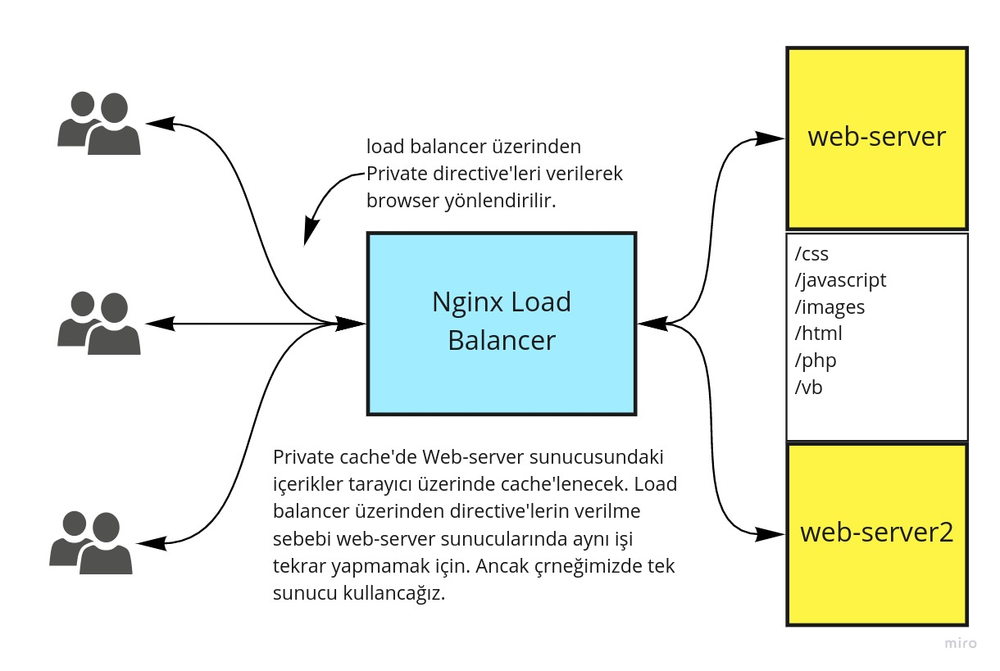

## Nginx Erişim Kontrolu ve Erişim Limitleme

Merhaba arkadaşlar,

Nginx'in en güzel özelliklerinden biri de içerikler için erişim kontrolü sağlamasıdır. Bu özellik sayesinde içerikleri kişiye, kaynak ip'ye, kendi belirlediğimiz diğer kriterlere göre erişime kapatabiliriz.


JWT ve OpenId SSO dışındaki güvenlik kontrolleri community (free) versiyonu ile birlikte bedava gelmektedir.

Nginx güvenlik kontrolleri için [şu sayfayı](https://docs.nginx.com/nginx/admin-guide/security-controls/) ziyaret edebilirsiniz. 


Bu yazımızda, 
- White/black list oluşturma
- Erişim Limitleme
- Basic Authentication
- Digest Authentication 
- SSL/TSL Termination

konularına değiniyor olacağız.


### Lab Ortamının Hazırlanması

Aynı ortamı private cache'i anlattığımız yazımıda kullanmıştık. Ancak yazılar arasında kaybolmamanız için burada da tekrarlıyorum.


### Lab Ortamının Hazırlanması


Örneklerimizde aşağıdaki gibi bir topoloji kullanıyor olacağız. Private cache için aslında araya proxy koymamıza gerek yok. Ancak ileride yapacağımız shared cache için buna benzer bir topolojiye ihtiyacımız olacağı için topolojiyi baştan kurmak vakit kazandıracaktır.

Ayrıca böyle bir topolojide içerik Cache-Control direktifleri doğrudan web-server üzerinde de yapılabilir. Proxy üzerinde yapmak arkaya sunucu eklediğinizde tekrar iş yapmak zorunda bırakmayacaktır. Tabii ki ihtiyaca göre kurgunuz da değişecektir. 





Web-server nginx konteyneri olarak çalıştıracağız ve html klasörüne statik içerikleri oluşturarak uygulamalarımızı yapacağız.

Aşağıdaki komutları kullanılarak konteynerleri çalıştırabilirsiniz.

```
docker run -d --name web-server -p 8080:80 ubuntu/nginx
docker run -d --name reverse-proxy -p 80:80 ubuntu/nginx
```
Önceki yazılarımızda olduğu gibi yine host makinemizde host dosyasına helloworld.com adresini 127.0.0.1 olarak ayarlıyoruz.

Daha sonra alttaki komutu doğrudan reverse-proxy üzerinde çalıştırarak proxy'mizi ayarlıyoruz.

```bash
cat << EOF >> /etc/nginx/conf.d/helloworld.conf 

upstream backend{

server 172.17.0.2; # web-server konteynerinin ip si sizde farklı olabilir
}

server {
  listen 80;
  server_name helloworld.com;
  location /  {
       proxy_pass http://backend;
       proxy_set_header X-Real-IP $remote_addr;
       proxy_set_header X-Forwarded-For   $proxy_add_x_forwarded_for;
       proxy_set_header X-Forwarded-Proto $scheme;
       proxy_set_header X-Forwarded-Port  $server_port;
       proxy_set_header Host              $host;
    }
}
EOF

```

Daha sonra web-server konteynerinde _/var/www/html#_ dizinine images,  jscript ve css  adında üç klasör oluşturuyoruz.

Daha sonra 
- jscript klasörüne iki adet içeriğinin ne olduğu önemli olmayan 1.js ve 2.js adında iki adet javascript dosyası, 
- css klasörüne  iki adet 1.css ve 2.css adında iki adet css dosyası 
- ve image klasörüne de ikişer adet (1.jpg, 2.jpg,1.png ve 2.png) adında jpg ve png  uzantılı 
dosya oluşturuyoruz.

İşimiz bittikten sonra iki konteyneri de restart ediyoruz. Lab ortamımız artık hazır.

### IP adresine göre black/white list oluşturma

Kurallar aşağıdan yukarıya doğru ezilerek yazılır. Örneğin aşağıda öncelikle bütün IP'ler reddedilmiş daha sonra 192.168.1.1/24 bloğuna tamamen izin verilmiş en son 192.168.1.2 ip'si bir önceki kuraldan çıkartılarak red verilmiş.

```conf
server {
        listen 12345;

        deny   192.168.1.2;
        allow  192.168.1.1/24;
        deny   all;
    }
```

Eğer bu şekilde çok fazla IP adresi varsa ve konfigürasyon dosyanızı da temiz tutmak istiyorsanız örneğin aşağıdaki gibi bir doya oluşturarak include yapabilirsiniz.

```conf
deny   10.10.1.4;
deny   10.10.1.3;
allow  10.10.1.1/24;
deny   192.168.1.2;
allow  192.168.1.1/24;
deny   all;
```

Dosya adı ip_list olsun

```conf
server {
        listen 12345;
        include ip_list;        
    }
```


### Erişim Limitleme

- **Bağlantı sayısını limitleme**

_/etc/nginx/conf.d/helloworld.conf_ dosyamızda server bloğunun dışında global bölüme alttaki satırı eliyoruz.  $binary_remote_addr ile ip adresine göre key oluşturacağımızı belirtmiş oluyoruz.

```conf
limit_conn_zone $binary_remote_addr zone=addr:10m;
```

Bu satır bize inmemory çalışan bir key-value store oluşturmuş oluyor. Nginx yazdığımız kurallara yönelik gerekli verileri tutuyor.

daha sonra örneğin download klasörüne aynı anda bir ip'den tek bir connection'a izin vermek istiyorsak alttaki kodu location bloğuna yazıyoruz. Bu arada limit_conn location {}, server {}, ve http {} bloklarına yazılabilir.

```conf
location ~ \.(jpg){
     limit_conn addr 1;
}

```
- **Request Rate Limitleme**

Herhangi bir isteğin bir ip adresinden ancak saniyede bir kez yapılmasını sağlam istiyoruz diyelim.

rate=1r/s denilen kısımda saniyede 1 request'e izin verdiğimizi ve $binary_remote_addr ile de bunu ip adresine göre yapmak isteğimizi belitmiş oluyoruz.

```conf
http {
    #...
    limit_req_zone $binary_remote_addr zone=my-zone:10m rate=1r/s;
}
```
Bu zonu kullanmak içinde location bloğuna aşağıdaki satırı ekliyoruz. 

```conf
    location ~ \.(js){

            limit_req zone=my-zone;
        }

```
Nginx kuralımızı test edebilmek için bize  _limit_req_dry_run_ direktifini sunuyor. Alttaki direktifi location bloğu içine kopyalayıp test edebiliriz. 

```conf
 limit_req_dry_run on;
```

log'larımızda test süresince yaptığımız istekler _dry run_ kelimeleriyle işaretlenmiş olacaktır.

- **Bandwidth Limitleme**

Örneğin download klasörüne gelen her bir istek için 100 KB limiti koymak için kullanılabilir.

Bu örneği test etmek için büyük boyutlu bir dosya koyup dosyanın uzantısını alttaki kodda png yerine yazarak test edebilirsiniz.


```bash
    location ~ \.(png){

    limit_rate 100k;
}
```

Ip adresine göre limit koymak için zone oluşturoyruz. _/etc/nginx/conf.d/helloworld.conf_ dosyamızda server bloğunun dışında global bölüme alttaki satırı eliyoruz.

```bash
limit_conn_zone $binary_remote_address zone=addr:10m
```
daha sonra location bloğuna alttaki satırları ekliyoruz. _limit_rate_after_ direktifi ile ilk 1 MB'dan sonra limiti uygula demiş oluyoruz.

```bash
    location ~ \.(css){

            limit_conn       addr 1;
            limit_rate_after 1m;
            limit_rate       50k;
        }
```

- **Dinamik Bandwidth Limitleme**

Örneğin tarayıcımızın yeni teknolojileri destekleyip desteklememesine (örneğin TLS versiyonuna) göre yada kullandığımız tarayıcıya göre bandwith belirlemek gibi dinamik parametrelere göre bandwith ayarlanmak istenirse


```bash
map $ssl_protocol $response_rate {
    "TLSv1.1" 10k;
    "TLSv1.2" 100k;
    "TLSv1.3" 1000k;
}

server {
    listen 443 ssl;
    ssl_protocols       TLSv1.1 TLSv1.2 TLSv1.3;
    ssl_certificate     www.example.com.crt;
    ssl_certificate_key www.example.com.key;

    location / {
        limit_rate       $response_rate; # TLS versiyonuna göre limitle
        proxy_pass       http://my_backend;
    }
}
```

### Basic Authentication

Nginx username, password oluşturmak için apache2-utils paketi ile gelen htpasswd cli'ını kullanıyor. Bunu oluşturmak için farklı araçlarda kullanılabilir tabii ki sonuçta bir isim (key) ve karşısında base64 ile oluşturulmuş bir anahtar var dosyada. Ancak bu araca (apache2-utils) ulaşmak çok kolay zaten bütün Linux sürümlerinde var bu nedenle farklı bir araç aramayacağız. 

Basic authentication için ngx_http_auth_basic_module modulü kullanılır.

Reverse-proxy konteynerimize alttaki komutla kurulumunu yapıyoruz. 

```bash
apt install apache2-utils
```

Komut satırında sadece htpasswd yazıp enter'a basarsak yardım metni gelecektir. Çok basit bit kullanımı var, önce dosya oluşturup daha sonra da kullanıcı ekleyeceğiz. Aşağıdaki komutla hem dosya ekleyip hem de admin kullanıcısını ekliyoruz.

```bash
htpasswd -c /etc/nginx/.htpasswd admin
```

dosyaya baktığımızda admin kullanıcısının oluştuğunu görebiliriz.

```bash
cat /etc/nginx/.htpasswd

admin:$apr1$DDo84w0l$tKU.ONNTAS1J4ZDbR2VDr/
```
Amacımız web-server konteynerimizdeki jscript klasörünü kullacınıcı adı ve şifreyle girilebilir yapmak.

Bunun için _/etc/nginx/conf.d/helloworld.conf_ dosyamıza alttaki bloğu ekliyoruz.

```bash
location ~* /jscript/ {
   proxy_pass http://backend;

   auth_basic "şifreli alan";
   auth_basic_user_file conf/htpasswd;
  
}

```
adresi çağırdığınızda username ve şifre ile giriş yapabilirsiniz.


### Digest Authenticaiton

Basit olarak basic ile digest arasındaki fark kullanıcı adı ve şifre basic'de sadece base64 iken digest'da hash'inin (md5) alınmasıdır. Basic'e göre daha güvenlidir.

Ancak Nginx tarafından doğrudan desteklenmez. Desteklediği açık kaynak modüller var ancak örneğin plus (paralı) versiyonlarında bile kurulu gelmiyor. Mesela bunlardan birini [Nginx resmi blok sayfasında](https://www.nginx.com/resources/wiki/modules/auth_digest/) görebilirsiniz.

Burada da basic authentication'daki htpasswd dosyasına benzer bir dosya oluşturmak gerekiyor. Bunun için htdigest adında bir araç var. Bunu daha önce kurmuş olduğumuz apache2-utils paketi ile kurmuş olduk zaten.


alttaki komutla dosyamızı oluşturuyoruz.

```bash
htdigest -c /etc/nginx/.htdigest secure-website admin
```

Bundan sonrasını [GitHub sayfasından](https://github.com/atomx/nginx-http-auth-digest/blob/master/readme.rst) takip etmeniz gerekiyor. Çok fazla kullanılmayan bir modül ve Nginx'in belki en zor yerlerinden biri bu tarz modulleri kurma kısmı çünkü Nginx'i de bu modülü de build almak gerekiyor.

İlerleyen yazıların bir tanesi zaten modüllerle alakalı olacağı için konun devamını oradan da takip edebilirsiniz.

### SSL/TSL Termination

Bu bölüm için self-signed sertifikaya ihtiyacımız olacak. Bunun için bir çok araç var.
- [cfssl](https://github.com/cloudflare/cfssl)
- [lets encrypt](https://letsencrypt.org/)
- [openssl](https://www.openssl.org/)


Biz openssl ile devam edeceğiz.

Anacak öncelikle bir önceki yaptıklarımı da korumak için ayrıca aralarındaki farkı da inceleyebilmek için ikinci bir reverse proxy kuracağız bunu için alttaki komutla konteynerimizi ayağa kaldırıyoruz.

```bash
docker run -d --name reverse-proxy-ssl -p 443:443 ubuntu/nginx
```
daha sonra update ve upgrade işlemlerini yapmak için alttaki komutla çalışan konteynerimize giriş yapıyoruz.


```bash
docker exec -it reverse-proxy-ssl  bash
```

daha sonra update ve upgrade işlemlerimiz yapıyoruz arkasından openssl'i kuruyoruz.

```bash
apt update
apt upgrade
apt install openssl
apt install vim
```

alttaki komutla openssl'i kuruyoruz.

```
sudo apt-get install openssl
```

ardından alttaki komutla sertifikamızı oluşturuyoruz.

```
openssl req -x509 -nodes -days 3650 -newkey rsa:2048 -keyout /etc/ssl/private/helloworld.key -out /etc/ssl/certs/helloworld.crt
```
komutu yazıp enter'a bastığınızda sorulacak sorular ve cevapları

```bash
Country Name (2 letter code) [AU]:TR
State or Province Name (full name) [Some-State]:Cankaya
Locality Name (eg, city) []:Ankara
Organization Name (eg, company) [Internet Widgits Pty Ltd]:Hello World Ltd
Organizational Unit Name (eg, section) []:IT
Common Name (e.g. server FQDN or YOUR name) []:helloworld.com
Email Address []:info@helloworld.com
```

Sertifikamız hazır.  Alttaki komutla konfigürasyon dosyamızı oluşturuyoruz ve konteyneri restart ediyoruz.

```bash
cat << EOF >> /etc/nginx/conf.d/helloworld.conf
upstream backend{
  server 172.17.0.2;
}


server  {

  listen 443 ssl;

  server_name helloworld.com;


  ssl_certificate /etc/ssl/certs/helloworld.crt;
  ssl_certificate_key /etc/ssl/private/helloworld.key;


location /  {

  proxy_pass http://backend;
  }
}
EOF
```

konteyneri restart ettikten sonra tarayıcımızda _https://helloworld.com_ adresini çağırdığımızda sitemizin güvenli olmadığını ifade eden bir mesajla karşılaşacağız. Amacımız Nginx SSL konfigürasyonunu görmek olduğu için uzun uzadıya bir sertifika üretimine girişmedik. Bu nedenle de sertifikamızı imzalamak için bir _Certificate Authority_ kullanmadık. 

Gelen ekranda "advanced" seçeneğinden  "Proceed to helloworld.com (unsafe)" linkine tıklayıp sayfamızı görebiliriz.

Tabii elimizde gerçek bir sertifika olsaydı, daha doğrusu işletim sistemimizin veya tarayıcımızın tanıdığı bir _Certificate Authority_'nin  imzaladığı sertifikamız olsaydı bu hatayı almıyor olacaktık.

Umarım faydalı olmuştur. Bir sonraki yazımız Nginx'de modül kullanımı hakkında olacak. Faydalı okumalar diliyorum.

## Kaynaklar

- https://docs.nginx.com/nginx/admin-guide/security-controls/configuring-jwt-authentication/
- https://docs.nginx.com/nginx/admin-guide/security-controls/configuring-http-basic-authentication/
- https://docs.nginx.com/nginx/admin-guide/security-controls/controlling-access-by-geoip/
- https://docs.nginx.com/nginx/admin-guide/security-controls/securing-http-traffic-upstream/
- https://docs.nginx.com/nginx/admin-guide/security-controls/denylisting-ip-addresses/
- https://docs.nginx.com/nginx/admin-guide/security-controls/controlling-access-proxied-http/
- https://www.nginx.com/blog/rate-limiting-nginx/
- https://www.nginx.com/resources/wiki/modules/auth_digest/
- http://nginx.org/en/docs/http/ngx_http_auth_basic_module.html
